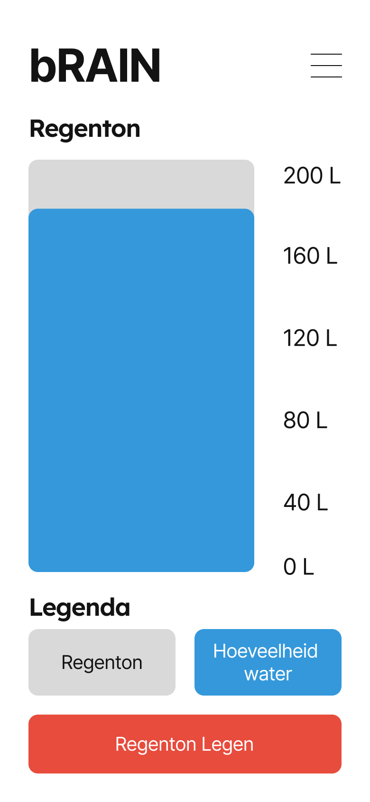
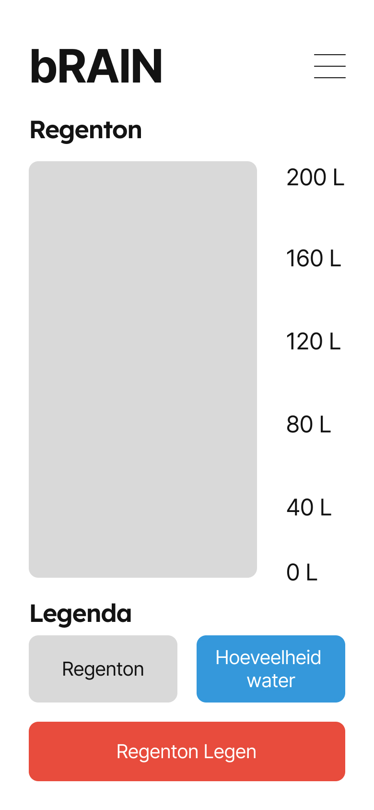
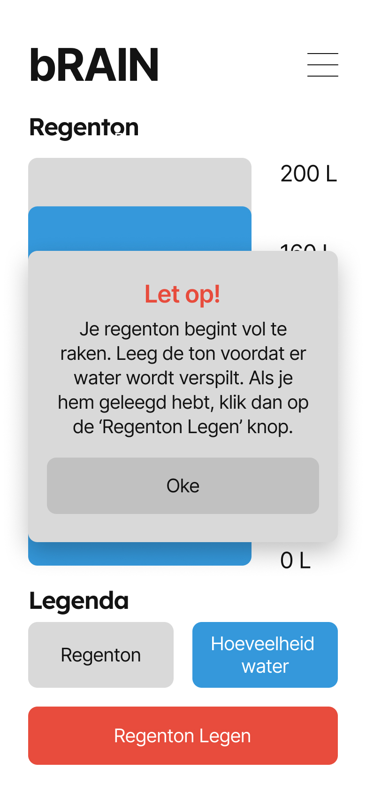
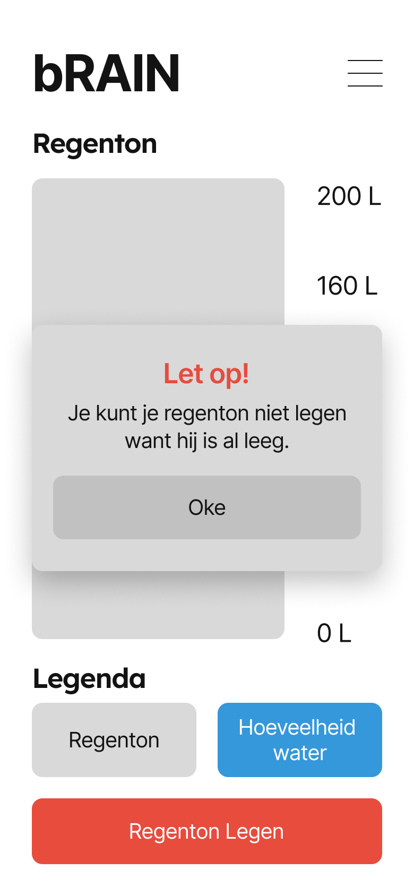
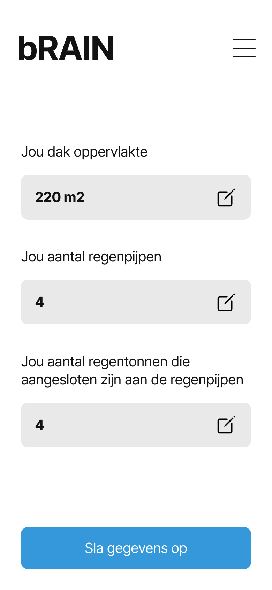
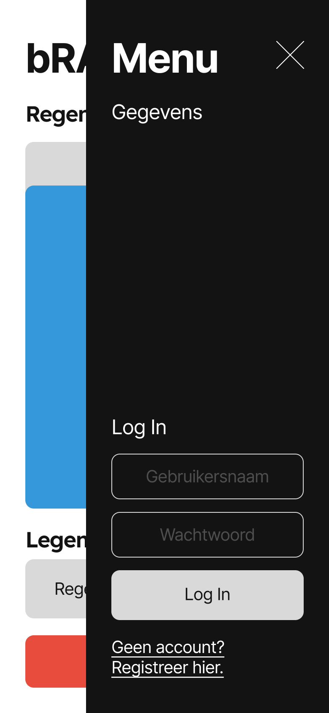

# Meesterproef Read.me

## Inhoudsopgave
- [Introductie](#introductie)
  - [Design Challenge](#design-challenge)
  - [User Stories](#user-stories)
- [Week 1](#week1)
  - [Briefing](#briefing)
  - [De-briefing](#de-briefing)
    - [Achtergrond Informatie](#achtergrond-informatie)
    - [Opdrachtomschrijving](#opdrachtomschrijving)
    - [Aanleiding](#aanleiding)
    - [Projectdoel](#projectdoel)
    - [Doelstelling](#doelstelling)
    - [Gebruikers van het eindresultaat](#gebruikers-van-het-eindresultaat)
    - [Relatie met andere projecten](#relatie-met-andere-projecten)
- [Week 2](#week2)
   - [Design Versie 1](#designv1)
- [Week 3](#week3)
   - [Design Versie 1](#designv1)

## Introductie
Daniël, Martijn en ik hebben voor de case 'bRAIN' gekozen. bRAIN is het project rondom het koppelen van weerberichten aan wateropvang/gebruik in de tuin.

Weersextremen in Nederland nemen steeds verder toe. Enerzijds komen periode van droogte tekorten vaker voor en anderzijds hebben we vaker te maken met extreme neerslag, met wateroverlast tot gevolg. Hier willen we als Nederland zijnde op voorbereid zijn. In de gemiddelde gemeente is 50 tot 60 procent van het totaal oppervlak privaat terrein. Daarom is het essentieel dat ook de private ruimte klimaatadaptief wordt ingericht. Dit betekent dat je bewoners moet overtuigen om klimaatadaptief te worden. Een van de manieren om dit te doen waarin je zowel droogte als extreme neerslag voor een deel kan bufferen is doormiddel van regentonnen.

### Design Challenge 
Ontwerp en ontwikkel een web applicatie die inzicht geeft in de hoeveel water die er op een bepaald moment van de dag in de regenton zit. Daarnaast moet er een melding gegeven worden dat de regenton geleegd moet worden op het moment dat er veel regen voorspelt is. De data die hier aan gekoppeld zit is dus: hoeveelheid regen (huidig en toekomstig), dakoppervlak, aantal regenpijpen en geschat volume regenton (e.g. 250L water). Je wil in de app dus zien hoe vol de regenton zit en hoeveel water je al verzamelt hebt. Er moet een reset knop opzitten die de regenton weer virtueel leegt en weer opnieuw kan vollopen aan de hand van de hoeveelheid regen.

### User Stories 
1. Als bewoner, wil ik graag inzicht in de hoeveelheid drinkwater wat ik bespaard heb/hoeveelheid regenwater wat ik heb opgevangen, zodat ik weet hoe duurzaam ik al bezig ben en zodat ik weet hoeveel ik al heb bijgedragen aan het tekort aan drinkwater/voorkomen van wateroverlast in mijn tuin.

2. Als bewoner, wil ik graag weten wanneer ik mijn regenton moet legen, zodat ik mijn regenton zo efficiënt mogelijk kan gebruiken.

3. Als gemeente, wil ik graag weten hoeveel regentonnen er geïnstalleerd zijn en wat het bufferend vermogen is van mijn bewoners, zodat ik inzicht krijg in hoeverre we als gemeente klimaatadaptief zijn als het gaat om droogte en weersextremen en zo ook inzicht krijg de effectiviteit van een dergelijke maatregel.

## Week 1

### Briefing 
Op 30 Mei gaan we voor het eerst met de hele groep langs bij onze opdrachtgever in Noord. Om dit voor te bereiden hebben we wat vragen opgesteld.
1.  Waarom willen we het aantal regenpijpen weten? Wordt er bij elke regenpijp een ton gezet? Of loopt een regenpijp gewoon de grond in?
2.  

### De-briefing 
We hebben eerst een de-briefing geschreven om de opdracht de verduidelijken.

#### Achtergrond Informatie 
30 Mei zijn we voor het eerst langs geweest bij SPATwater in Noord. Hier hebben we kennis mogen maken met drie van de vier werknemers van SPATwater, namelijk Mees, Mees en Jesse. SPATwater is ontstaan toen Mees en Jesse afstudeerden van de master hydrologie. Ze zijn toen begonnen met het opzetten van het bedrijf. Het bedrijf houdt zich voornamelijk bezig met klimaatadaptatie, een cruciaal onderwerp gezien de toename van hevige regenbuien en periodes van droogte. Normaal gesproken geeft het bedrijf adviezen op het gebied van water aan gemeenten door het hele land, maar nu hebben ze een nieuw project. Hiervoor zijn wij ingeschakeld.

#### Opdrachtomschrijving 
SPATwater wilt een applicatie waarin gebruikers een overzicht hebben om de regenopvang in de regenton van het huis te kunnen beheren. Om hiermee meer regenwater op te vangen zodat dit in de grond kan verdwijnen en drinkwater te besparen.

#### Aanleiding 
Omdat het klimaat zo aan het veranderen is en er tegenwoordig steeds hevigere regenbuien zijn en periodes van droogtes, wilt onze opdrachtgever meer gebruik gaan maken van regentonnen. Dit om meer regenwater op te vangen en dit in de tuin te laten lopen. Het is namelijk zo dat veel van het regenwater nu het riool inloopt en vervolgens wordt gedumpt in sloten en rivieren. Hierdoor verdwijnt het water uiteindelijk in de zee en wordt het zout. Het is dus beter als het regenwater bijvoorbeeld voor het besproeien van de tuin wordt gebruikt en in het grondwater verdwijnt.

#### Projectdoel 
SPATwater heeft ons gevraagd een applicatie te ontwikkelen waarbij bewoners een regenton kunnen instellen en met deze applicatie kunnen zien hoeveel regenwater zij hebben opgevangen in de regenton. Hiermee krijgen de bewoners hulp bij het beheren van de opslag van het regenwater. Er zal een melding worden verstuurd wanneer de regenton geleegd moet worden zodat er maximaal water kan worden opgevangen en minder water wordt verspild.

#### Doelstelling 
De doelstelling van het bedrijf is simpel gezegd het voorkomen van waterverspilling doormiddel van het gebruik van regentonnen.

#### Oplevering 
De applicatie zal de weersvoorspellingen van het KNMI integreren om te kunnen anticiperen op komende regenbuien. Gebruiksvriendelijkheid is hierbij cruciaal; we willen dat de tool makkelijk te gebruiken en visueel aantrekkelijk is. Het prototype moet indrukwekkend zijn - we willen de bewoners omverblazen met ons idee. De app moet tijdig meldingen sturen wanneer de regenton vol dreigt te raken.

#### Randvoorwaarden 
Het project zal ook uitdagingen met zich meebrengen, zoals het bepalen of het dak schuin of plat is. Hiermee krijg je te maken met verdamping van water waardoor de accuraatheid van de hoeveelheid water in de regenton moeilijker te bepalen wordt. Hierdoor kunnen verkeerde voorspellingen worden gemaakt. Ook kan het zijn dat er meerdere regenpijpen zijn en dat niet elke regenpijp is aangesloten op een regenton. De bewoners staan centraal en hier moet ook op gefocust worden. Als de applicatie niet fijn te gebruiken is door bewoners is het niet functioneel.

#### Gebruikers van het eindresultaat 
Onze gebruikers van het eindresultaat zullen klimaatbewust bezig zijn met water. Ze verspillen minder drinkwater en zorgen ervoor dat er meer grondwater in de grond komt. Hierdoor dragen ze bij aan een verbeterd milieu. De bewoners staan centraal en dit is ook de gebruiker. Ook de gemeente Amsterdam moet inzicht kunnen hebben echter moeten we focussen op de gebruiker.

#### Relatie met andere projecten 
Er is al een soortgelijke app beschikbaar genaamd Perceelwijzer, waarin je data kan krijgen over verschillende percelen in Nederland. Denk hierbij aan bijvoorbeeld neerslag maar ook of er gemaaid mag worden. Deze app maakt dus al gebruik van het aantal mm neerslag dat er per perceel valt. Wij zullen ook zoiets moeten integreren, maar wij gebruiken hiervoor de KNMI API.

## Week 2 

### Design Versie 1
Als eerst ben ik gaan kijken naar hoe onze web app gedesigned zou moeten worden. Ik heb hierbij de core-functionaliteit van de app meegebracht. Wij hebben als team besloten dat de core-functionaliteit is dat de gebruiker binnen de app een regenton kan aanmaken en dat de gebruiker kan zien hoeveel regen er in de regenton valt, zodat de gebruiker tijdig zijn regenton kan legen en er dus geen water wordt verspilt.

Mijn eerste concept houdt hier rekening mee. 

Ik heb een homepage gemaakt waarin de core-functionaliteit centraal staat. De gebruiker kan zien hoeveel water er in zijn regenton zit, en kan de regenton legen zodra deze vol begint te raken.

Dit is de state waarin de regenton leeg is.

Dit is de state waarin de regenton geleegd moet worden. De app geeft de gebruiker dan een melding dat de regenton bijna vol is, en dat deze geleegd moet worden voordat het water verspilt wordt.

Dit is de state waarin de regenton al geleegd is. De app geeft de gebruiker dan een melding dat de regenton niet geleegd kan worden omdat de regenton al geleegd is.  

Op deze pagina kan de gebruiker de gegevens van zijn regenton bekijken. 

Dit is een menu wat geopent wordt zodra de gebruiker op het hamburger menu icoon tikt.  

## Week 3 

### Design Versie 2
Als eerst ben ik gaan kijken naar hoe onze web app gedesigned zou moeten worden. Ik heb hierbij de core-functionaliteit van de app meegebracht. Wij hebben als team besloten dat de core-functionaliteit is dat de gebruiker binnen de app een regenton kan aanmaken en dat de gebruiker kan zien hoeveel regen er in de regenton valt, zodat de gebruiker tijdig zijn regenton kan legen en er dus geen water wordt verspilt.

### Onboarding
